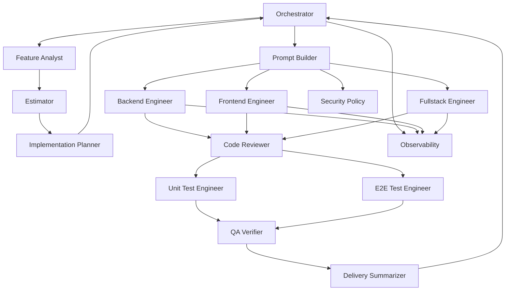

# Agent Interactions

```mermaid
flowchart TD
    O[Orchestrator] --> FA[Feature Analyst]
    FA --> E[Estimator]
    E --> IP[Implementation Planner]
    IP --> O
    O --> PB[Prompt Builder]
    PB --> BE[Backend Engineer]
    PB --> FE[Frontend Engineer]
    PB --> FS[Fullstack Engineer]
    BE --> CR[Code Reviewer]
    FE --> CR
    FS --> CR
    CR --> UT[Unit Test Engineer]
    CR --> E2E[E2E Test Engineer]
    UT --> QA[QA Verifier]
    E2E --> QA
    QA --> DS[Delivery Summarizer]
    DS --> O
    O --> OBS[Observability]
    PB --> SEC[Security Policy]
    BE --> OBS
    FE --> OBS
    FS --> OBS
```
