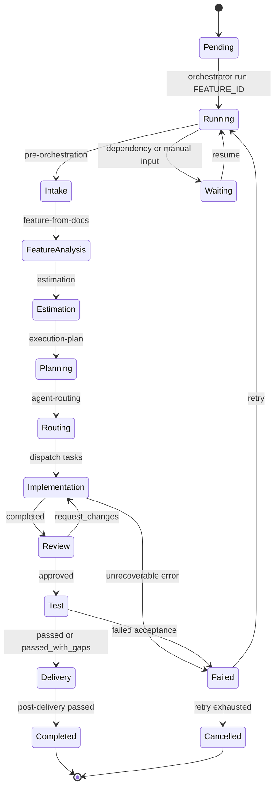

# Execution Flow

```mermaid
stateDiagram-v2
    [*] --> Pending
    Pending --> Running: orchestrator run FEATURE_ID
    Running --> Intake: pre-orchestration
    Intake --> FeatureAnalysis: feature-from-docs
    FeatureAnalysis --> Estimation: estimation
    Estimation --> Planning: execution-plan
    Planning --> Routing: agent-routing
    Routing --> Implementation: dispatch tasks
    Implementation --> Review: completed
    Implementation --> Failed: unrecoverable error
    Review --> Test: approved
    Review --> Implementation: request_changes
    Test --> Delivery: passed or passed_with_gaps
    Test --> Failed: failed acceptance
    Delivery --> Completed: post-delivery passed
    Running --> Waiting: dependency or manual input
    Waiting --> Running: resume
    Failed --> Running: retry
    Failed --> Cancelled: retry exhausted
    Completed --> [*]
    Cancelled --> [*]
```
