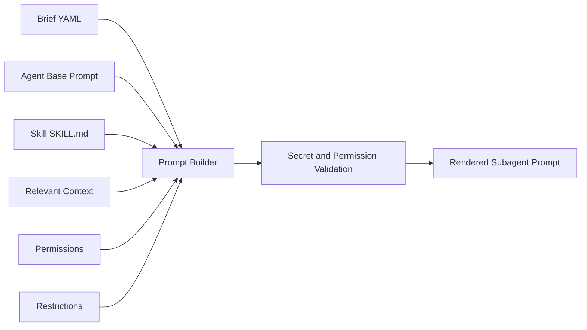

# Prompt Builder

```mermaid
flowchart LR
    B[Brief YAML] --> PB[Prompt Builder]
    A[Agent Base Prompt] --> PB
    S[Skill SKILL.md] --> PB
    C[Relevant Context] --> PB
    P[Permissions] --> PB
    R[Restrictions] --> PB
    PB --> V[Secret and Permission Validation]
    V --> OUT[Rendered Subagent Prompt]
```
